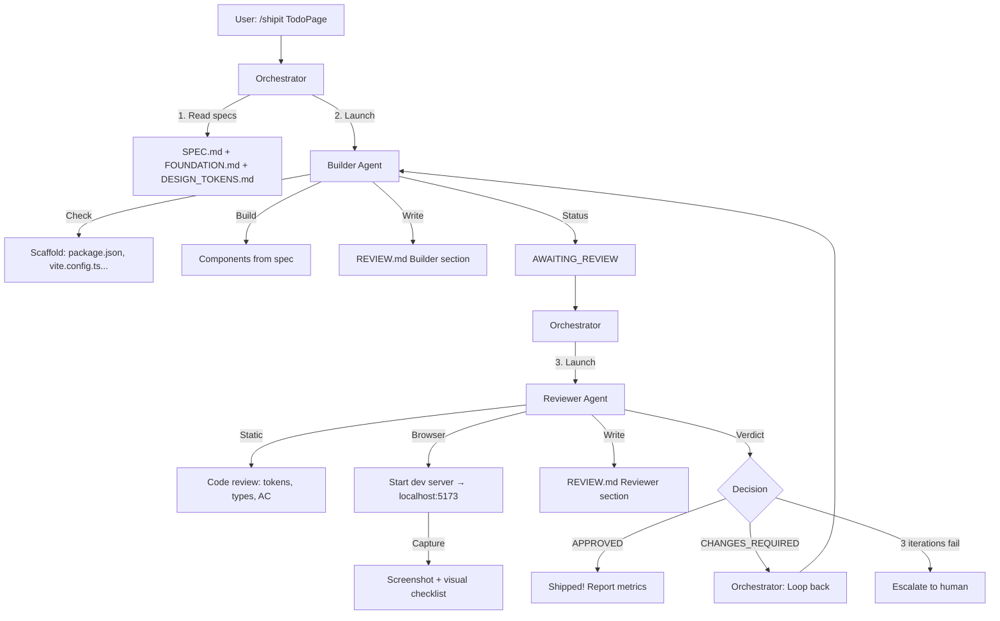

# Cursor Subagent Showcase

> Multi-agent collaboration for UI development: Builder creates, Reviewer validates, loop until quality gates pass.

## The Problem

Traditional single-agent approach:
```
User: "Build me a kanban board"
Agent: *builds* "Done!"
User: *opens browser* "Colors are wrong, layout is broken"
Agent: *tries to fix* "Better?"
User: "Still broken..."
```

Same agent builds and self-reviews. **No objective quality gate.**

## The Solution

Separate concerns like real teams do:
- **Builder Agent**: Optimistic implementation
- **Reviewer Agent**: Skeptical validation (code + browser)
- **Orchestrator**: Coordinates the loop, tracks metrics

## Workflow



## File Architecture

| Layer | Files | Purpose |
|-------|-------|---------|
| **Spec** | `SPEC.md`, `FOUNDATION.md`, `DESIGN_TOKENS.md`, `assets/*.png` | Requirements & design tokens |
| **Agent** | `shipit/SKILL.md`, `builder-agent.md`, `reviewer-agent.md` | Execution logic |
| **State** | `REVIEW.md` | Unified Builder↔Reviewer communication |

## Usage

```bash
# In Cursor IDE:
/shipit follow SPEC.md to build the kanban board
```

## What Gets Measured

| Metric | Target | Example |
|--------|--------|---------|
| AC Pass Rate | 100% | 24/25 criteria pass |
| Visual Match | ≥95% | 96% vs wireframe |
| Console Errors | 0 | No runtime errors |
| Design Tokens | 100% | No hardcoded values |
| Iterations | ≤3 | Efficiency indicator |

## Token Consumption Estimate

| Agent | Input | Output | Subtotal |
|-------|-------|--------|----------|
| **Builder** (per iteration) | ~15K (specs + review state) | ~25K (scaffold + components) | ~40K |
| **Reviewer** (per iteration) | ~25K (specs + generated code) | ~5K (feedback + verdict) | ~30K |
| **Orchestrator** (overhead) | ~2K | ~1K | ~3K |
| **Per Iteration Total** | - | - | **~73K tokens** |

### Typical Run
| Scenario | Iterations | Total Tokens |
|----------|------------|--------------|
| First-time perfect | 1 | ~73K |
| Typical (1 fix cycle) | 2 | ~146K |
| Max iterations | 3 | ~220K |

*Note: Estimates based on kanban board complexity (MEMO panel + 3 columns + 6+ components). Simpler components = lower consumption.*

## Why This Works

1. **Objective validation**: Reviewer is "blind" to Builder's intent
2. **Quantified results**: "96% match" beats "looks good"
3. **Forced iteration**: Quality gates must pass
4. **Clear accountability**: Who built vs who judged

---

## End Result

This section documents the actual implementation output from running the multi-agent workflow.

### kimi 2.5 Build

| Attribute | Value |
|-----------|-------|
| **Model** | kimi 2.5 |
| **Branch** | `git checkout actual-result-kimi25` |
| **Implementation** | Full kanban board with MEMO panel, 3 columns, toggle, and toolbar |

**Given UI Wireframe:**


**Actual UI Screenshot:**


*The above screenshot shows the final rendered output after the Builder-Agent → Reviewer-Agent loop completed successfully.*

---

## Project Notes

This demo uses a **complex kanban board** (MEMO panel + 3 columns + toggle + toolbar) to stress-test:
- Multi-component orchestration
- Browser-based visual validation
- Iterative improvement loops
