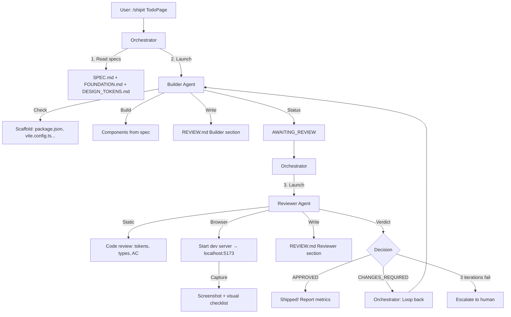
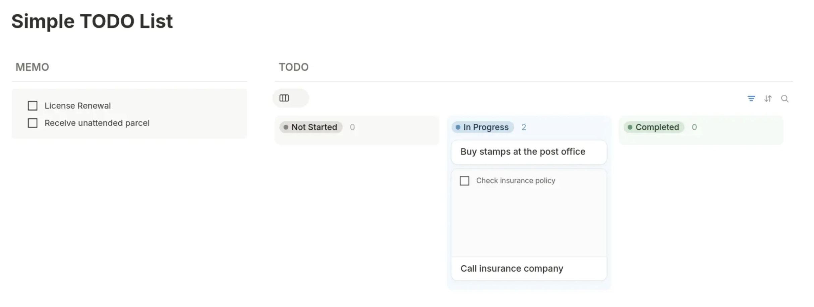
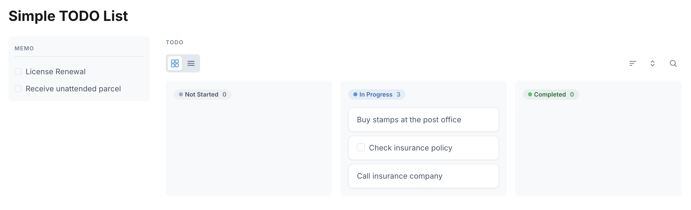

# Cursor Subagent Showcase

> Multi-agent collaboration for UI development: Builder creates, Reviewer validates, loop until quality gates pass.

## The Problem

Traditional single-agent approach:
```
User: "Build me a kanban board"
Agent: *builds* "Done!"
User: *opens browser* "Colors are wrong, layout is broken"
Agent: *tries to fix* "Better?"
User: "Still broken..."
```

Same agent builds and self-reviews. **No objective quality gate.**

## The Solution

Separate concerns like real teams do:
- **Builder Agent**: Optimistic implementation
- **Reviewer Agent**: Skeptical validation (code + browser)
- **Orchestrator**: Coordinates the loop, tracks metrics

## Workflow



## File Architecture

| Layer | Files | Purpose |
|-------|-------|---------|
| **Spec** | `SPEC.md`, `references/FOUNDATION.md`, `references/DESIGN_TOKENS.md`, `assets/*.png` | Requirements and **Visual contract** (tokens) |
| **Orchestrator** | `.cursor/skills/shipit/SKILL.md` | Multi-component waves, SQLite-only gates |
| **Agents** | `.cursor/agents/builder-agent.md`, `reviewer-agent.md`, `e2e-agent.md` | Scoped build / review / E2E |
| **State** | `./review_history.db`, optional `./agentic-todo.db` | Orchestration DB + app DB; human status via `npm run progress` |

## Usage

```bash
# In Cursor IDE:
/shipit follow SPEC.md to build the kanban board
```

## What Gets Measured

| Metric | Target | Example |
|--------|--------|---------|
| AC Pass Rate | 100% | 24/25 criteria pass |
| Visual Match | ≥95% | 96% vs wireframe |
| Console Errors | 0 | No runtime errors |
| Design Tokens | 100% | No hardcoded values |
| Iterations | ≤3 | Efficiency indicator |

## Token Consumption Estimate

| Agent | Input | Output | Subtotal |
|-------|-------|--------|----------|
| **Builder** (per iteration) | ~15K (specs + review state) | ~25K (scaffold + components) | ~40K |
| **Reviewer** (per iteration) | ~25K (specs + generated code) | ~5K (feedback + verdict) | ~30K |
| **Orchestrator** (overhead) | ~2K | ~1K | ~3K |
| **Per Iteration Total** | - | - | **~73K tokens** |

### Typical Run
| Scenario | Iterations | Total Tokens |
|----------|------------|--------------|
| First-time perfect | 1 | ~73K |
| Typical (1 fix cycle) | 2 | ~146K |
| Max iterations | 3 | ~220K |

*Note: Estimates based on kanban board complexity (MEMO panel + 3 columns + 6+ components). Simpler components = lower consumption.*

## Why This Works

1. **Objective validation**: Reviewer is "blind" to Builder's intent
2. **Quantified results**: "96% match" beats "looks good"
3. **Forced iteration**: Quality gates must pass
4. **Clear accountability**: Who built vs who judged

---


## Side-by-Side Comparison (Wireframe -> Actual Output)

<table>
  <tr>
    <td width="50%" valign="top">
      <strong>Given UI Wireframe (Spec Artifact)</strong><br/>
      
    </td>
    <td width="50%" valign="top">
      <strong>Actual UI Built by kimi 2.5</strong><br/>
      
    </td>
  </tr>
</table>

*The comparison above shows the final rendered output (right) against the original wireframe specification (left) after the Builder-Agent → Reviewer-Agent loop completed successfully.*

---

## Project Notes

This demo uses a **complex kanban board** (MEMO panel + 3 columns + toggle + toolbar) to stress-test:
- Multi-component orchestration
- Browser-based visual validation
- Iterative improvement loops

## Branches and profiles

| Branch | Profile | Visual contract |
|--------|---------|-----------------|
| `agentic-patterns` | Default multi-agent shipit; token/CSS contract in agents, skills, and SPEC | `references/DESIGN_TOKENS.md` + CSS variables (`src/styles/tokens.css`) |
| `agentic-patterns-braid` | Same orchestration flow; alternate UI profile on that branch (see its SPEC §1 and references) | Defined on that branch only |

Orchestration (Builder / Reviewer / E2E / shipit board + SQLite gates) is shared conceptually; only SPEC §1, §6, §8, and foundation styling differ by branch.

**First live `/shipit` on a new machine:** set `max_concurrent_components: 1` in `.cursor/skills/shipit/SKILL.md` for one serial green run, then raise to `3` for parallel waves if desired.
